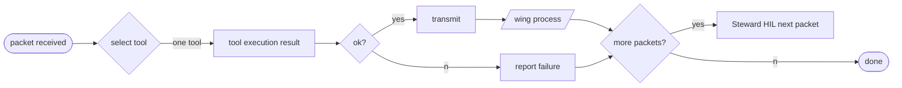

# NOVA Flow Diagrams

## 1) Grand Pipe: Main Architecture

```mermaid
graph TD
    A[Steward HIL] -->|control plane| B[TUI/GUI]
    B -->|palace DB access| C[(palace SQLite)]
    D[daemon tick] --> E[homes/ingest/mail]
    F[/ask command] --> G[Ollama inference]
    H[/claw command] --> I[127.0.0.1:18789]
    J[/qwen command] --> K[qwen --prompt]
    L[Ollama TTS service] -->|:8000| M[Audio output]
    I -.may visit.-> N[Grok API]
    K -.may visit.-> N[Grok API]
```

## 2) Sub-loop: Packet Processing



## Architectural Principles

- Three processes stay three: steward, brain, leash.
- Claw is servant not merger; acts as executor, not data combiner.
- HIL (Horse Interface Layer) precedes all writes and external operations.
- Grok Automation is not an OpenClaw strap; optional external hook.
- Snap is not a real HWND; window handle abstraction only.
